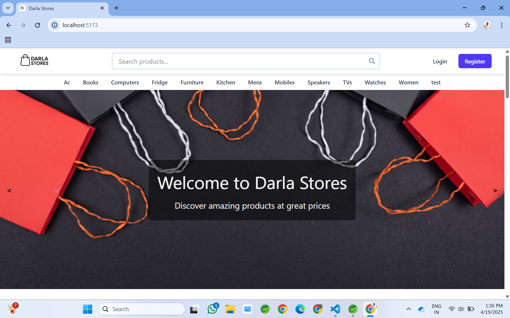

# 🛍️Full Stack E-Commerce Application (Spring Boot + React)


This project is a fully functional E-Commerce Full Stack Application built using Spring Boot, React and Postgresql, providing RESTful APIs to manage user authentication ( JWT + OAuth2 ), product & categories management, reviews & ratings, cart & checkout functionality, order processing, refund handling, Profile manage.


The project is structured to follow clean coding practices, spring MVC layered architecture, and includes validations, role-based access control, and user-friendly error handling.


👉 [Watch Full Demo Video Here]()


---
## 🔗 Live Demo

> Deployment link coming soon...

## 🚀 Features

### 👥 Authentication & User Management
- 🔐 User registration and login (standard + OAuth2)
- 🔁 Forgot/Reset password functionality
- ✏️ Profile update and password change
- 📩 Sending Emails for confirmation like OTPs, orders, status updates
- 🧠 **OTP management using Redis** for secure and time-limited access
- 🔒 JWT-based secure token management
- 🗑️ **User account deletion or deactivation** for managing account status


### 🛍️ Shopping Cart & Orders
- 🛒 Add, remove, increment, and decrement products in the cart
- 🧾 Place individual orders or checkout entire cart
- 📜 View past orders and their statuses
- ❌ Cancel pending orders before they are delivered

### 💰 Payment Integration
- 💳 Secure payment gateway integrated using **Razorpay**
- 🧾 Supports order payments and refunds
- 🔔 Sends confirmation email upon successful payment


### ⭐ Reviews & Product Experience
- ✍️ Add and delete product reviews
- 🔍 Product search, detailed view, and filtered browsing by category
- 📄 **Pagination** for product reviews with the ability to navigate through multiple pages


### 🧰 Admin Panel (Interactive UI)
- 📦 Manage products, categories, carousels with individual or bulk via CSV File
- 🧑‍💼 View all users and their details
- 📈 Track metrics and order statistics
- 📬 Update order statuses, track payments, issue refunds

### 📧 Email Services
- 📤 Sends verification email post registration
- 🔁 Sends OTPs for password reset (managed via **Redis**)
- 📬 Order confirmation and status update notifications
- 🔔 Notifies user upon password change

## 🛡️ Security
- JWT authentication with `Bearer` tokens
- OAuth2 login via Google/Facebook/GitHub
- Role-based access: `@PreAuthorize("hasRole('ADMIN')")`
- Encrypted password storage with `BCrypt`
- Global exception handling and CORS config

---

## 🧪 Validation

- DTO validation using `@Valid`
- Common error messages returned with timestamps
- Unique email checks and password strength enforcement

---
## ⚙️ Tech Stack

### 🖥️ Backend
- **Java 17**
- **Spring Boot** – REST API development
- **Spring Security** – Authentication & Authorization (JWT & OAuth2)
- **Spring Data JPA** – ORM with Hibernate
- **Redis** – OTP and token management
- **PostgreSQL** – Relational database
- **Java MailSender** – Email services (verification, password reset, order updates)
- **Lombok** – Boilerplate code reduction
- **Validation** – DTO validation using `@Valid`
- **Maven** – Build automation

### 🌐 Frontend
- **React JS**
- **React Router** – Client-side routing
- **Tailwind CSS** – Utility-first styling
- **Axios** – HTTP client for API calls
- **HTML5 & CSS3**
- **JavaScript (ES6+)**
- **React Context API** – State management
- **React Hot Toaster** – Notifications and alerts

## 🗃️ Database Design

- **PostgreSQL** – Relational database used for managing users, products, orders, reviews, and more.
- **Redis** – In-memory data store used for:
  - Storing and verifying OTPs
  - Temporary token/session handling

### 🔑 Core Entities (Tables):
- **Users** – Handles user registration, profile info, roles (admin/user)
- **Products** – Product catalog with detailed information
- **Categories** – Product categorization for filtering
- **Carts** – Stores user cart items with quantity control
- **Orders** – Order placements with status tracking
- **Reviews** – Customer feedback on products
- **Carousels** – Admin-configured homepage banners

---

## 📁 Project Structure
```
project-root/
│
├── backend/             // Spring Boot Backend
│   └── src/
│
├── frontend/            // React Frontend (or any JS framework)
│   └── src/
│
├── redis/               // Redis setup (optional docker-compose or local)
│
└── README.md
```
#### 📁 Backend Project Folder Structure

```
com.darla
│
├── controller              # All REST API controllers
├── dto                     # DTOs for request and response formats
├── entity                  # JPA entities (e.g., User, Product, Order, Carousel)
├── exception_handling      # Global and custom exception handlers
├── mapper                  # Entity <-> DTO mappers
├── repository              # Spring Data JPA repositories
├── security                # Spring Security configurations (JWT, OAuth2, Password encoding, etc.)
├── service                 # Business logic layer

```

#### 📁 Frontend Project Folder Structure

```
src
│
├── api-services        # Handles all backend API calls using Axios
├── assets              # Static assets like images, icons
├── components          # Reusable UI components
├── pages               # Route-based components
│   ├── admin           # Admin-specific pages (metrics, management, etc.)
│   ├── auth            # Login, registration, forgot password, etc.
│   ├── Others          # Cart.jsx, UserDashboard.jsx etc.
│
├── state-management    # Context API or other global state logic
├── App.jsx             # Main app structure and route definitions
├── main.jsx            # App entry point
├── index.css           # Global styles

```

---

## 🚀 How to Run Locally

### 🔧 Prerequisites

- **Java 17+** and **Maven**
- **Node.js** and **npm/yarn**
- **Redis** (locally or Docker(prefered) )
- **MySQL/PostgreSQL** or the database you're using

---
### 1. Clone the Repository
First, clone the repository to your local machine:
```bash
git clone https://github.com/uday900/Darla-Stores-Ecommerce-Application.git
## 📦 Backend (Spring Boot)
```

### 2. Navigate to backend directory
```bash
cd backend
```

### 3. Configure `application.properties`

Before running the backend, you'll need to configure the following essential properties in the `src/main/resources/application.properties` file:

---

### ✅ Essential Properties (`src/main/resources/application.properties`)

#### 🗄️ PostgreSQL Database
Configure your database settings:
```properties
spring.datasource.url=jdbc:postgresql://localhost:5432/YOUR_DB_NAME
spring.datasource.username=YOUR_DB_USERNAME
spring.datasource.password=YOUR_DB_PASSWORD
```

#### 🔐 Google OAuth (Optional: for social login)
If you're using Google OAuth for social login, set the credentials:
```properties
spring.security.oauth2.client.registration.google.client-id=YOUR_GOOGLE_CLIENT_ID
spring.security.oauth2.client.registration.google.client-secret=YOUR_GOOGLE_CLIENT_SECRET
```

#### 💳 Razorpay Integration
To enable Razorpay payment integration, update the API credentials:
```properties
razorpay.api.key=YOUR_RAZORPAY_KEY
razorpay.api.secret=YOUR_RAZORPAY_SECRET
```

#### 📧 Email Configuration (Gmail SMTP)
For email notifications (like order confirmations, password resets, etc.):
```properties
spring.mail.username=YOUR_EMAIL       # Use your own email
spring.mail.password=YOUR_EMAIL_APP_PASSWORD     # Recommended to use App Password
```

#### 🌐 Frontend URL (for CORS)
If your frontend runs on a different port, update the URL to match:
```properties
frontend.url=http://localhost:5173
```

### 4. Build & Run the Backend

Once the `application.properties` file is configured, you can build and run the backend:

```bash
./mvnw spring-boot:run
```

> The backend will start at `http://localhost:8080`

---

### 4. Navigate to frontend directory

```bash
cd frontend
```

### 5. Install dependencies
```bash
npm install
# or
yarn install
```
### 6. Configure environment variables

Before running the frontend, you'll need to set up the following environment variables in a `.env` file in the root of the `frontend` directory:

```bash
VITE_BACKEND_API=http://localhost:8080 (backend url)
VITE_RAZORPAY_KEY=YOUR_RAZORPAY_KEY
```
### 6. Start development server
```bash
npm run dev
# or
yarn dev
```

> The frontend usually runs at `http://localhost:5173` (or configured port)

---

## 💾 Redis

### Option 1: Local Installation

Install Redis from [https://redis.io/download](https://redis.io/download)

```bash
redis-server
```

### Option 2: Docker

```bash
docker run -d -p 6379:6379 --name redis redis
```

### Option 3: docker-compose.yml
Create a `docker-compose.yml` file:

```yaml
version: '3'
services:
  redis:
    image: redis
    ports:
      - "6379:6379"
```

Run:
```bash
docker-compose up
```

---

## ✅ Verify All Services

| Service   | URL                        |
|-----------|----------------------------|
| Backend   | http://localhost:8080      |
| Frontend  | http://localhost:5173      |
| Redis     | `localhost:6379`           |

---

## 🧪 Testing the App

You can use tools like **Postman** or **Thunder Client** to test backend APIs.

Example:
```http
GET http://localhost:8080/categories
```

## 🔐 Admin Credentials (Demo)

You can use the following credentials to log in as an admin and test the admin functionalities:

- **Email:** `admin@darla.com`  
- **Password:** `admin123`

---

## End Points

## 🔐 Authentication APIs

| Method | Endpoint                            | Description                                       |
|--------|-------------------------------------|---------------------------------------------------|
| GET    | `/auth/oauth/login?mode={mode}`     | Redirect to Google OAuth (mode = login/register) |
| POST   | `/auth/login`                       | Login user and return JWT token                  |
| POST   | `/auth/register`                    | Register a new user                              |
| POST   | `/auth/verify-token?token={token}`  | Verify JWT token validity                        |
| POST   | `/auth/send-otp-to-email?email={email}` | Send OTP to user's email                    |
| POST   | `/auth/verify-otp-and-set-password?email={email}&otp={otp}&password={password}` | Verify OTP and set new password |

---

## 📦 Category APIs

| Method | Endpoint                               | Description                              |
|--------|----------------------------------------|------------------------------------------|
| GET    | `/category`                            | Get all categories                       |
| GET    | `/category/{id}`                       | Get category by ID                       |
| POST   | `/category`                            | Add a new category (Admin only)          |
| POST   | `/category/upload-csv`             | Add multiple categories through CSV File (Admin only)     |
| PUT    | `/category/{id}`                       | Update a category by ID (Admin only)     |
| DELETE | `/category/{id}`                       | Delete a category by ID (Admin only)     |


---

## 🛒 Product APIs

| Method | Endpoint                                 | Description                                |
|--------|------------------------------------------|--------------------------------------------|
| GET    | `/products/metrics`                      | Fetch product metrics (Admin only)         |
| GET    | `/products`                              | Get all products (Admin only)              |
| GET    | `/products/{id}`                         | Get product by ID                          |
| POST   | `/products`                              | Add a new product (Admin only)             |
| POST   | `/products/upload-csv`                 | Add multiple products through CSV File (Admin only)         |
| PUT    | `/products/{id}`                         | Update a product by ID (Admin only)        |
| DELETE | `/products/{id}`                         | Delete a product by ID (Admin only)        |
| GET    | `/products/showcase`                     | Get showcase/featured products             |
| GET    | `/products/category?category=xyz`        | Get products by category name              |
| GET    | `/products/search?query=xyz`             | Search products by query                   |

---

## 🎠 Carousel APIs

| Method | Endpoint                                 | Description                                |
|--------|------------------------------------------|--------------------------------------------|
| GET    | `/products/carousels`                    | Fetch all carousel images                  |
| POST   | `/products/carousels/add`                | Add new carousel image (Admin only)        |
| DELETE | `/products/carousels/{id}`               | Delete a carousel image by ID (Admin only) |

---


## 📝 Review APIs

| Method | Endpoint                                     | Description                                 |
|--------|----------------------------------------------|---------------------------------------------|
| POST   | `/reviews`                                   | Add a new review (User only)                |
| GET    | `/reviews/product/{productId}`               | Get all reviews for a specific product      |
| GET    | `/reviews/{reviewId}`                        | Get a specific review by ID                 |
| PUT    | `/reviews/{reviewId}?rating=&comment=`       | Update a review (User only)                 |
| DELETE | `/reviews/{reviewId}/user/{userId}`          | Delete a review by ID and user ID           |

---


### 👤 **User Management**
| Method | Endpoint               | Description                      |
|--------|------------------------|----------------------------------|
| GET    | `/user/oauth/info`     | Get OAuth2 user information      ||--------|--------------------------|----------------------------------|
| POST   | `/user/update-password`  | Update user password             |
| GET    | `/user/info`             | Get user information by ID       |
| GET    | `/user/all`              | Fetch all users (Admin only)     |
| PUT    | `/user/update/profile`   | Update user profile              |

---

### 🛒 **Cart Management**
| Method | Endpoint                    | Description                      |
|--------|-----------------------------|----------------------------------|
| POST   | `/user/cart/add`            | Add product to cart              |
| DELETE | `/user/cart/remove`         | Remove product from cart         |
| PUT    | `/user/cart/increment`      | Increment product quantity       |
| PUT    | `/user/cart/decrement`      | Decrement product quantity       |
| GET    | `/user/cart`                | Fetch user's cart items          |


---

### 📦 **Order Management**
| Method | Endpoint                          | Description                                                             |
|--------|-----------------------------------|-------------------------------------------------------------------------|
| POST   | `/user/order/create`               | Place an order                                            |
| POST   | `/user/order/checkout`            | Checkout entire cart                                      |
| POST   | `/user/order/verify`              | Verify payment and order with Razorpay                                  |
| POST   | `/user/order/payment-failure`     | Handle payment failure                                                  |
| POST   | `/user/order/{orderId}/refund`    | Issue refund for an order (Admin only)                                  |
| PUT    | `/user/order/update`              | Update order status: Admin for delivery/refund, User for cancellation   |
| GET    | `/user/orders/all`                | Get all orders (Admin only)                                             |
| GET    | `/user/orders`                    | Get orders by user ID                                                   |

---


## 🧑‍💻 Author

**DARLA UDAYA KIRAN**  
📧 [udaykirandarla2002@gmail.com](mailto:udaykirandarla2002@gmail.com)  
🌐 [LinkedIn](https://www.linkedin.com/in/darla-uday-kiran-18a450239)

---
